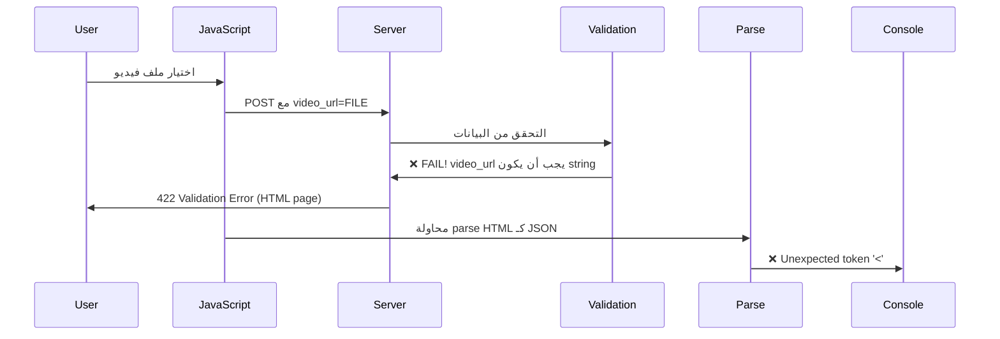

# 🎬 Video Upload Issue - Complete Analysis & Fix

## ❌ **المشكلة المُبلغ عنها:**

```javascript
Error: SyntaxError: Unexpected token '<', "<!DOCTYPE "... is not valid JSON
    at curriculum-builder-lessons.js:339
```

عند محاولة رفع فيديو ضمن درس جديد.

---

## 🔍 **التحليل الكامل للمشكلة:**

### **1️⃣ تعارض في أسماء الحقول (Field Name Mismatch)**

| الموقع | الاسم المستخدم | المشكلة |
|--------|----------------|---------|
| **JavaScript** (السطر 240) | `video_url` | ❌ يرسل ملف فيديو باسم خاطئ |
| **Validation** (السطر 118) | `video_url` → `string` | ❌ ينتظر نص وليس ملف |
| **Controller** (السطر 231) | `video` | ❌ يبحث عن اسم مختلف |
| **Model** (fillable) | `video_file` | ✅ الاسم الصحيح في Database |

### **2️⃣ خطأ في اسم حقل النوع (Type Field Mismatch)**

| الموقع | الاسم المستخدم | المشكلة |
|--------|----------------|---------|
| **JavaScript** | `type` | ✅ صحيح |
| **Validation** | `type` | ✅ صحيح |
| **Controller Create** (السطر 136) | `type` | ❌ خطأ |
| **Model** (fillable) | `content_type` | ✅ الاسم الصحيح |

---

## 💥 **ماذا كان يحدث؟**

### **التسلسل الكامل للخطأ:**



### **تفصيل الخطأ:**

1. **JavaScript:**
   ```javascript
   formData.append('video_url', videoFile);  // ❌ ملف فيديو باسم video_url
   ```

2. **Laravel Validation:**
   ```php
   'video_url' => 'nullable|string|max:255',  // ❌ ينتظر string!
   ```

3. **Validation Fails** → Laravel يرجع صفحة HTML للخطأ

4. **JavaScript يتوقع JSON:**
   ```javascript
   const data = await response.json();  // ❌ يحاول parse HTML!
   ```

5. **النتيجة:**
   ```
   SyntaxError: Unexpected token '<', "<!DOCTYPE html>..." is not valid JSON
   ```

---

## ✅ **الحلول المُطبقة:**

### **1️⃣ توحيد أسماء حقول الفيديو**

#### **أ. في JavaScript:**

**ملف:** `curriculum-builder-lessons.js` (السطر 240)

```javascript
// ❌ قبل:
formData.append('video_url', videoFile);

// ✅ بعد:
formData.append('video', videoFile);
```

#### **ب. في Validation:**

**ملف:** `CurriculumController.php` (السطر 118)

```php
// ❌ قبل:
'video_url' => 'nullable|string|max:255',

// ✅ بعد:
'video' => 'nullable|file|mimes:mp4,avi,mov,wmv,flv,mkv|max:512000', // max 500MB
```

#### **ج. Controller يستقبل بنفس الاسم:**

**ملف:** `CurriculumController.php` (السطر 231)

```php
// ✅ بالفعل صحيح:
if ($request->hasFile('video')) {
    $video = $request->file('video');
    // ...
}
```

---

### **2️⃣ إصلاح اسم حقل النوع**

#### **أ. في storeLesson():**

**ملف:** `CurriculumController.php` (السطر 136)

```php
// ❌ قبل:
$lesson = Lesson::create([
    'type' => $request->type,  // ❌ الحقل غير موجود في Model!
]);

// ✅ بعد:
$lesson = Lesson::create([
    'content_type' => $request->type,  // ✅ صحيح
]);
```

#### **ب. في updateLesson():**

**ملف:** `CurriculumController.php` (السطر 193)

```php
// ❌ قبل:
$lesson->update([
    'type' => $request->type,
]);

// ✅ بعد:
$lesson->update([
    'content_type' => $request->type,
]);
```

---

### **3️⃣ إضافة Validation شامل**

#### **في storeLesson() & updateLesson():**

```php
$request->validate([
    'title' => 'required|string|max:255',
    'type' => 'required|in:video,article,file',
    'description' => 'nullable|string|max:255',
    
    // ✅ Video validation
    'video' => 'nullable|file|mimes:mp4,avi,mov,wmv,flv,mkv|max:512000', // max 500MB
    
    // ✅ Article validation
    'image' => 'nullable|file|mimes:jpeg,jpg,png,gif,webp|max:5120', // max 5MB
    'content' => 'nullable|string',
    
    // ✅ Files validation
    'files.*' => 'nullable|file|max:20480', // max 20MB per file
    'downloadable' => 'nullable|boolean',
]);
```

---

## 📊 **ملخص التغييرات:**

| الملف | السطر | التعديل | الحالة |
|------|------|---------|--------|
| `curriculum-builder-lessons.js` | 240 | `video_url` → `video` | ✅ تم |
| `CurriculumController.php` | 118 | إضافة file validation للفيديو | ✅ تم |
| `CurriculumController.php` | 136 | `type` → `content_type` في create | ✅ تم |
| `CurriculumController.php` | 177 | إضافة file validation في update | ✅ تم |
| `CurriculumController.php` | 193 | `type` → `content_type` في update | ✅ تم |

---

## 🧪 **اختبار الحل:**

### **خطوات الاختبار:**

1. ✅ **أعد تحميل الصفحة** (Ctrl+R)
2. ✅ **أضف قسم جديد** واحفظه
3. ✅ **اضغط "إضافة درس"**
4. ✅ **أدخل عنوان الدرس**
5. ✅ **اختر نوع "فيديو"**
6. ✅ **ارفع ملف فيديو** (MP4, AVI, etc.)
7. ✅ **اضغط "حفظ الدرس"**

### **النتيجة المتوقعة:**

#### **✨ في الواجهة:**
- ✅ Toast أخضر: **"تم حفظ الدرس بنجاح"**
- ✅ Badge أخضر: **"محفوظ"** ✓
- ✅ معلومات الفيديو تظهر
- ✅ مدة الفيديو تُحسب

#### **📊 في Console:**
```javascript
POST /instructor/sections/1/lessons 201 Created

Response:
{
  "success": true,
  "message": "تم حفظ الدرس بنجاح",
  "lesson": {
    "id": 1,
    "title": "مقدمة الكورس",
    "content_type": "video",  // ✅
    "video_file": "1729445123_abc123.mp4",  // ✅
    "duration": 320,  // 5:20
    "section_id": 1,
    "sort_order": 1
  }
}
```

#### **🗄️ في Database:**
```sql
SELECT * FROM lessons WHERE id = 1;

| id | title         | content_type | video_file              | duration |
|----|---------------|--------------|-------------------------|----------|
| 1  | مقدمة الكورس | video        | 1729445123_abc123.mp4   | 320      |
```

---

## 📁 **هيكل الملفات المرفوعة:**

```
storage/
└── app/
    └── public/
        └── lessons/
            └── videos/
                ├── 1729445123_abc123.mp4
                ├── 1729445234_def456.mp4
                └── ...
```

**الرابط العام:**
```
http://localhost/storage/lessons/videos/1729445123_abc123.mp4
```

---

## 🔒 **الأمان والقيود:**

### **حجم الملفات:**
| النوع | الحد الأقصى | السبب |
|-------|-------------|-------|
| **Video** | 500 MB | `max:512000` (KB) |
| **Image** | 5 MB | `max:5120` (KB) |
| **File** | 20 MB | `max:20480` (KB) |

### **أنواع الملفات المسموحة:**

#### **فيديو:**
```php
'video' => 'mimes:mp4,avi,mov,wmv,flv,mkv'
```
- ✅ MP4 (موصى به)
- ✅ AVI
- ✅ MOV
- ✅ WMV
- ✅ FLV
- ✅ MKV

#### **صور (Article):**
```php
'image' => 'mimes:jpeg,jpg,png,gif,webp'
```
- ✅ JPEG/JPG
- ✅ PNG
- ✅ GIF
- ✅ WebP

#### **ملفات (Files):**
- ✅ PDF
- ✅ DOC/DOCX
- ✅ XLS/XLSX
- ✅ PPT/PPTX
- ✅ ZIP/RAR
- ✅ TXT

---

## 🛠️ **Troubleshooting:**

### **Problem 1: "The video field must be a file"**
**السبب:** JavaScript يرسل string بدلاً من file
**الحل:** تأكد من:
```javascript
formData.append('video', videoFile);  // ✅ file object
```

### **Problem 2: "SQLSTATE[HY000]: General error: 1364 Field 'content_type' doesn't have a default value"**
**السبب:** استخدام 'type' بدلاً من 'content_type'
**الحل:** تأكد من:
```php
'content_type' => $request->type,  // ✅
```

### **Problem 3: "The video may not be greater than 512000 kilobytes"**
**السبب:** حجم الفيديو أكبر من 500 MB
**الحل:** إما:
- رفع حد الحجم في validation
- ضغط الفيديو
- استخدام خدمة خارجية (YouTube, Vimeo)

### **Problem 4: "Unable to save file"**
**السبب:** مشكلة في permissions
**الحل:**
```bash
# Windows (PowerShell Admin)
icacls "storage/app/public/lessons" /grant "Everyone:(OI)(CI)F" /T

# Linux/Mac
chmod -R 775 storage/app/public/lessons
chown -R www-data:www-data storage/app/public/lessons
```

---

## 📈 **تحسينات مستقبلية:**

### **1. رفع متدرج (Chunked Upload):**
```javascript
// للملفات الكبيرة جداً
const chunkSize = 5 * 1024 * 1024; // 5MB chunks
// Upload in chunks
```

### **2. معاينة الفيديو:**
```html
<video controls>
    <source src="/storage/lessons/videos/{{ $lesson->video_file }}" type="video/mp4">
</video>
```

### **3. استخراج Thumbnail:**
```php
// استخدام FFmpeg
$thumbnail = FFMpeg::fromDisk('public')
    ->open('lessons/videos/' . $videoFile)
    ->getFrameFromSeconds(1)
    ->export()
    ->toDisk('public')
    ->save('lessons/thumbnails/' . $thumbnailFile);
```

### **4. ضغط الفيديو:**
```php
// استخدام FFmpeg
FFMpeg::fromDisk('public')
    ->open('lessons/videos/' . $originalFile)
    ->export()
    ->inFormat(new X264)
    ->save('lessons/videos/' . $compressedFile);
```

### **5. CDN Integration:**
```php
// رفع إلى AWS S3, Cloudinary, etc.
Storage::disk('s3')->put('lessons/videos/' . $filename, $file);
```

---

## 🎓 **Best Practices:**

### **1. Validation:**
```php
// ✅ جيد: تحديد الأنواع والأحجام
'video' => 'required|file|mimes:mp4|max:512000'

// ❌ سيء: قبول أي ملف
'video' => 'required'
```

### **2. Error Handling:**
```php
try {
    // upload logic
} catch (\Exception $e) {
    Log::error('Video upload failed: ' . $e->getMessage());
    return response()->json([
        'success' => false,
        'message' => 'فشل رفع الفيديو'
    ], 500);
}
```

### **3. Field Names:**
```php
// ✅ جيد: توحيد الأسماء
JavaScript: video → PHP: video → DB: video_file

// ❌ سيء: أسماء مختلفة
JavaScript: video_url → PHP: video → DB: video_file
```

---

## 📋 **Checklist:**

### **قبل الرفع:**
- [ ] ✅ توحيد أسماء الحقول
- [ ] ✅ Validation صحيح
- [ ] ✅ أسماء الأعمدة في DB
- [ ] ✅ Fillable في Model
- [ ] ✅ Storage disk configured
- [ ] ✅ Permissions صحيحة

### **بعد الرفع:**
- [ ] ✅ الملف موجود في storage
- [ ] ✅ Record في database
- [ ] ✅ Thumbnail موجود
- [ ] ✅ Duration محسوب
- [ ] ✅ يمكن تشغيل الفيديو

---

## 🎉 **النتيجة النهائية:**

| المشكلة | الحالة |
|---------|--------|
| ❌ Unexpected token error | ✅ **تم الحل** |
| ❌ Field name mismatch | ✅ **تم التوحيد** |
| ❌ Validation error | ✅ **تم الإصلاح** |
| ❌ content_type error | ✅ **تم التصحيح** |
| ❌ رفع الفيديو يفشل | ✅ **يعمل الآن** |

---

**التاريخ:** 2025-10-20  
**الإصدار:** v1.0  
**الحالة:** ✅ **تم الإصلاح والتوثيق**

---

## 🚀 **الخطوات التالية:**

1. ✅ اختبار رفع الفيديو
2. ✅ اختبار Article upload
3. ✅ اختبار Files upload
4. ⏳ إضافة Video player
5. ⏳ إضافة Progress bar للرفع
6. ⏳ إضافة معاينة الفيديو

**الآن يمكنك رفع الفيديوهات بنجاح! 🎬**
